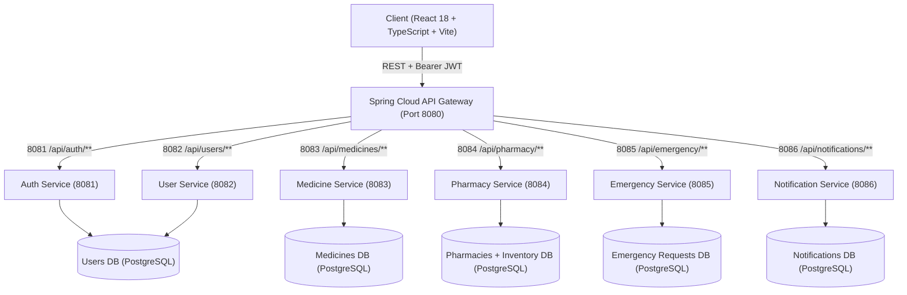

# MediFind-Medicine-Availability-Network-Platform

> **Find your medicine. Keep moving.**  
> MediFind is a hyper-local healthcare platform that bridges patients, local pharmacies, and pharmacists. It solves prescription scavenger hunts through real-time inventory queries, verified generic medicine alternatives, interactive map locators, and an SOS emergency medicine broadcast system.

---

## 📌 Table of Contents

- [Overview](#-overview)
- [Key Features](#-key-features)
  - [For Patients & Users](#for-patients--users)
  - [For Pharmacies & Pharmacists](#for-pharmacies--pharmacists)
- [System Architecture](#-system-architecture)
  - [Microservices Ecosystem](#microservices-ecosystem)
  - [Frontend & BFF Stack](#frontend--bff-stack)
- [Project Directory Structure](#-project-directory-structure)
- [Getting Started](#-getting-started)
  - [Prerequisites](#prerequisites)
  - [Installation](#installation)
  - [Environment Configuration](#environment-configuration)
  - [Running the Development Server](#running-the-development-server)
  - [Building for Production](#building-for-production)
- [API Reference](#-api-reference)
- [Tech Stack](#-tech-stack)
- [Testing & Code Quality](#-testing--code-quality)
- [Contributing & License](#-contributing--license)

---

## 🌟 Overview

Finding specialized or urgent prescription medicines in local neighborhoods often turns into a time-consuming scramble. MediFind centralizes real-time pharmacy inventories and delivers an automated SOS emergency network so that patients get the medications they need without making dozens of phone calls or driving between multiple pharmacies.

---

## 🎯 Problem Statement

Every day, millions of Indians waste 30-60 minutes calling 10+ pharmacies to find a single medicine. Patients in emergencies (fever, infection, chronic conditions) often can't find critical medicines nearby. Existing apps like PharmEasy focus on home delivery (24-48 hours), not immediate local availability. Small independent pharmacies (80% of market) have no digital presence.

Result:

⏱️ Time Wasted: 30-60 minutes per medicine search

💸 Higher Costs: Patients buy expensive brands unaware of cheaper generics

🏥 Emergency Delays: Critical medicines unavailable when needed most

📉 Pharmacy Loss: Small pharmacies lose customers to big chains

---

## 🚀 Key Features

### For Patients & Users
- 🔍 **Live Medicine & Stock Search**: Search by brand name, generic chemical formula, or category with real-time stock levels.
- 💊 **Generic & Substitute Finder**: Automatic detection of generic bio-equivalents with real-time in-stock filtering when the primary brand is unavailable.
- 🗺️ **Interactive Geolocation & Maps**: Interactive Leaflet maps locating verified pharmacies nearby with real-time distance calculations, directions, operating hours, and contact details.
- 🚨 **Emergency SOS Broadcast**: Dispatch urgent medication requests to all pharmacies within an adjustable radius (2–10 km).
- ⏱️ **Real-Time Bid Tracking**: Receive instant responses from nearby pharmacists with pricing, stock readiness, and estimated delivery/pickup times.
- 👤 **Patient Dashboard & History**: Monitor active emergency requests, manage profile data, and post ratings and reviews.
- ✅ **Verified Pharmacies Only**: All pharmacies are admin-verified for trust and safety.

### For Pharmacies & Pharmacists
- 📊 **Pharmacist Command Center**: Manage inventory, stock quantities, unit pricing, and low-stock alert thresholds.
- ⚡ **Emergency Request Dispatch Inbox**: Live alerts for nearby patient SOS requests with single-click quotation responses.
- 🏬 **Pharmacy Profile & Geolocation**: Configure store profiles, operating schedules, licenses, and pin exact GPS coordinates using an interactive map picker.
- ⭐ **Reputation & Review System**: Track customer reviews, average star ratings, and community feedback.
- 📈 **Performance Analytics**: Track search appearances, phone inquiries, and emergency fulfillment metrics.
- 🆓 **Zero Commission Platform**: Get discovered by local patients without paying commissions to aggregators.

### For Administrators
- 💊 **Medicine Catalog Management**: Add, edit, and maintain standardized medicine database (prevent duplicates, ensure data quality).
- ✅ **Pharmacy Verification System**: Review and approve pharmacy registrations (verify licenses, prevent fraud).
- 👥 **User Management**: Monitor users, suspend abusive accounts, handle disputes.
- 📊 **Platform Analytics**: Track total users, pharmacies, medicines, emergency requests, and platform growth.

---

## 🏗️ System Architecture

MediFind is engineered as a modern frontend coupled with a Spring Cloud microservices architecture routed through a centralized API Gateway.



### Microservices Ecosystem

| Service | Port | Base Path | Core Responsibilities |
| :--- | :--- | :--- | :--- |
| **API Gateway** | `8080` | `/api/**` | Central reverse proxy, JWT routing, CORS management |
| **Auth Service** | `8081` | `/api/auth/**` | User & pharmacy owner registration, authentication, JWT tokens |
| **User Service** | `8082` | `/api/users/**` | Patient profiles, medical info, pharmacy reviews, stock-aware search |
| **Medicine Service** | `8083` | `/api/medicines/**` | Master medicine directory, generic equivalents, drug details |
| **Pharmacy Service** | `8084` | `/api/pharmacy/**` | Pharmacy store registry, GPS coordinates, inventory management, ratings |
| **Emergency Service**| `8085` | `/api/emergency/**`| SOS request creation, radius queries, pharmacist bids, order acceptance |
| **Notification Service** | `8086` | `/api/notifications/**` | Email, SMS, and in-app alert delivery |

### Frontend & BFF Stack
- **Framework**: React 18 + TypeScript + Vite
- **Styling**: Tailwind CSS v4 + Radix UI Primitives + Lucide Icons
- **State & Data**: TanStack React Query + Centralized Gateway Client
- **Maps & Geolocation**: Leaflet & React Leaflet
- **Animation & Visuals**: Framer Motion, Recharts

---

## 📁 Project Directory Structure

```text
MediFind/
├── client/                     # Frontend React application
│   ├── App.tsx                 # Root application component and route definitions
│   ├── global.css              # Global styling & Tailwind CSS imports
│   ├── components/
│   │   ├── dashboard/          # Pharmacist dashboard components & modals
│   │   │   ├── tabs/           # Overview, Inventory, Emergency, Analytics tabs
│   │   │   └── ...             # Pharmacy registration and map picker modals
│   │   ├── site/               # Site Header, Footer, navigation
│   │   ├── ui/                 # Reusable UI primitives (dialogs, buttons, toasts)
│   │   └── user/               # User modals (EmergencyRequestModal, LocationBar)
│   ├── hooks/                  # Custom React hooks (use-toast, use-mobile)
│   ├── lib/
│   │   ├── api.ts              # API client methods for all 6 microservices
│   │   ├── gateway-client.ts   # Centralized fetch wrapper with JWT interceptors
│   │   └── utils.ts            # Utility functions & class merges
│   └── pages/                  # Page routes
│       ├── Auth.tsx            # Patient login / registration
│       ├── ForPharmacies.tsx   # Landing page for pharmacy partners
│       ├── Index.tsx           # Main homepage
│       ├── MedicineSearch.tsx  # Search & generic alternative finder
│       ├── MyEmergencyRequests.tsx # Patient SOS request tracker
│       ├── PharmacistAuth.tsx  # Pharmacist login / onboarding
│       ├── PharmacyDashboard.tsx # Pharmacist portal & management
│       ├── PharmacyDetail.tsx  # Individual pharmacy view
│       ├── PharmacyDirectory.tsx # All pharmacies directory with filters
│       └── UserDashboard.tsx   # Patient account dashboard
├── public/                     # Static assets (icons, images)
├── server/                     # Express BFF / Dev SSR server
│   ├── index.ts                # Express server initialization
│   ├── node-build.ts           # Server build entrypoint
│   └── routes/                 # Health check and demo routes
├── shared/                     # Shared TypeScript interfaces & types
├── .env                        # Environment variable configuration
├── package.json                # Project dependencies & npm scripts
├── tailwind.config.ts          # Tailwind CSS theme configuration
├── tsconfig.json               # TypeScript configuration
├── vite.config.ts              # Vite client bundler configuration
└── vite.config.server.ts       # Vite server-side bundle configuration
```

---

## ⚡ Getting Started

### Prerequisites
- **Node.js**: `v18.x` or higher (v20+ recommended)
- **Package Manager**: `npm` (v9+) or `pnpm` (v10+)
- **Backend Services**: API Gateway running on port `8080` (or configured gateway URL)

### Installation

Clone the repository and install project dependencies:

```bash
git clone https://github.com/your-username/MediFind.git
cd MediFind
npm install
```

### Environment Configuration

Create or update the `.env` file in the root directory:

```env
# API Gateway Base URL (Spring Cloud Gateway)
VITE_API_GATEWAY_URL=http://localhost:8080

# Ping / Healthcheck Message
PING_MESSAGE="ping pong"
```

### Running the Development Server

Start the local Vite development server:

```bash
npm run dev
```

By default, the client will start on `http://localhost:5173` (or the next available port).

### Building for Production

Compile both the client-side SPA and server bundle:

```bash
npm run build
```

This runs:
- `npm run build:client` — Bundles static React assets into `dist/spa`
- `npm run build:server` — Bundles Express server into `dist/server`

To launch the production server:

```bash
npm run start
```

---

## 📡 API Reference

All requests pass through the centralized gateway client (`client/lib/gateway-client.ts`), which automatically attaches the `Authorization: Bearer <token>` header stored in `localStorage`.

### 1. Authentication (`authApi`)
- `POST /api/auth/register` — Register a standard patient account
- `POST /api/auth/pharmacy-owner/register` — Register a pharmacy owner account
- `POST /api/auth/login` — Authenticate and receive a JWT

### 2. User & Patients (`userApi`)
- `GET /api/users/profile` — Fetch current user profile
- `POST /api/users/profile` — Create user profile
- `GET /api/users/emergency` — Retrieve user's emergency requests
- `GET /api/users/pharmacies/nearby` — Get nearby pharmacies with medicine filter
- `GET /api/users/medicines/:id/alternatives-with-stock` — Stock-aware generic substitutes

### 3. Medicines & Catalog (`medicineApi`)
- `GET /api/medicines/search?name={name}` — Search medicine catalog
- `GET /api/medicines/:id` — Get medicine details
- `GET /api/medicines/:id/alternatives` — Get chemical generic alternatives
- `GET /api/medicines/:id/alternatives-with-stock` — Alternatives filtered by real-time pharmacy stock

### 4. Pharmacy Management (`pharmacyApi`)
- `POST /api/pharmacy/register` — Onboard new pharmacy
- `GET /api/pharmacy/:id` — Pharmacy details
- `GET /api/pharmacy/owner/:ownerId` — Fetch pharmacies belonging to an owner
- `GET /api/pharmacy/nearby?lat={lat}&lng={lng}&radius={km}` — Proximity search
- `GET /api/pharmacy/inventory` — View store inventory
- `POST /api/pharmacy/inventory` — Add medication item to inventory
- `PUT /api/pharmacy/inventory/:id` — Update stock quantity / price
- `DELETE /api/pharmacy/inventory/:id` — Remove medication item

### 5. Emergency SOS Requests (`emergencyApi`)
- `POST /api/emergency` — Dispatch emergency SOS request
- `GET /api/emergency/active` — List open emergency broadcasts
- `GET /api/emergency/nearby?lat={lat}&lng={lng}&radius={km}` — Regional active requests
- `POST /api/emergency/:id/respond` — Pharmacist bid response with price & time
- `POST /api/emergency/:id/accept/:responseId` — Patient accepts pharmacist quotation
- `PUT /api/emergency/:id/status` — Update emergency request status

### 6. Notifications (`notificationApi`)
- `POST /api/notifications/send` — Send in-app notification
- `POST /api/notifications/email` — Send transactional email
- `POST /api/notifications/sms` — Send SMS alert
- `GET /api/notifications/user?userId={id}` — Fetch notifications for a user
- `PATCH /api/notifications/:id/read` — Mark notification as read

### 7. Admin Operations
- `POST /api/admin/medicines` — Add new medicine (Admin only)
- `GET /api/admin/medicines` — List all medicines (Admin only)
- `GET /api/admin/pharmacies/pending` — Get pending pharmacy verifications (Admin only)
- `PUT /api/admin/pharmacies/:id/verify` — Approve pharmacy (Admin only)
- `PUT /api/admin/pharmacies/:id/reject` — Reject pharmacy with reason (Admin only)

---

## 🛠️ Tech Stack

| Domain | Technologies |
| :--- | :--- |
| **Frontend** | React 18, TypeScript, Vite, React Router DOM v6 |
| **UI Components** | Tailwind CSS v4, Radix UI primitives, Lucide Icons, Sonner |
| **Maps & Location** | Leaflet, @types/leaflet, Geolocation API |
| **Server / BFF** | Node.js, Express 5, CORS, Dotenv |
| **Backend Services** | Spring Cloud API Gateway, Spring Boot Microservices |
| **Form Handling** | React Hook Form, Zod |
| **Visualization** | Recharts, Framer Motion |
| **Testing & Quality** | Vitest, TypeScript, Prettier |

---

## 🧪 Testing & Code Quality

Run tests using [Vitest](https://vitest.dev/):
```bash
npm run test
```

Perform TypeScript type checking:
```bash
npm run typecheck
```

Format code with Prettier:
```bash
npm run format.fix
```

---

## 📄 License

This project is licensed under the [MIT License](LICENSE).
